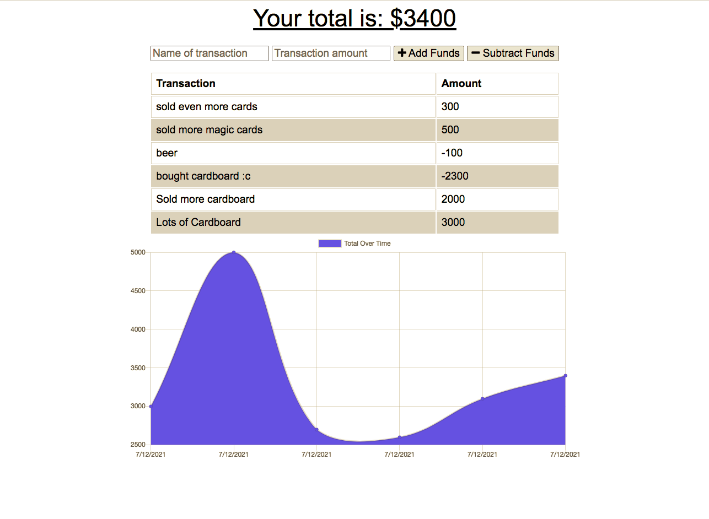

# Budget Tracker

## Install

to install this on your computer run:

```git clone```

in order to run this program on your local computer please run:

```npm start``` it with then be visable at "http://localhost:3000/"

## Visual 



the app will simply take in the name of the transaction and the amount. the user will then tell the app if it was a deposit (add funds) or a withdrawl (subtract funds).

history is logged below with a visual tracker as well.

## Deployed Site

https://lit-garden-66998.herokuapp.com/

